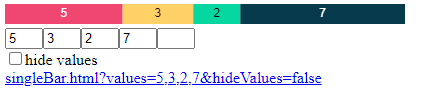

# singleBar
Simple single bar chart (uses p5.js)

# Parameters

* `values`: Array of numeric values (between 3 and 5 values in length) (no default)
* `hideValues`: Do not display the numeric values (default: false)
* `save`: Automatically download as PNG (the value of the `save` parameter is the filename) (no default)

# Use

* Copy the HTML and JS files to a local folder
  * Note: you must change the path to the JS file in the HTML (line 8) if you don't store them in the same folder
* *optional* Start a web server (Note: the page works when opening the HTML file from your browser without going through a web server)
* Open the HTML file - the page will open with a default array & show you the corresponding URL with all the parameters

# Sample
